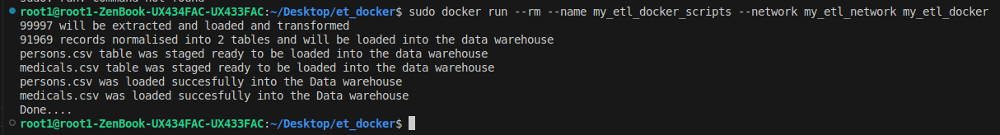

# STEPS IN IMPLEMENTING THIS PROJECT IN DOCKER
    After writing the simple etl scripts to extract patients info from the csv container 10k+ records, transfromed it by cleaning, selecting the needed records, doing a simple modelling into two dim tables and calculating BMI (body Mass Index) to know the patients, that are obese, overweight or underweight. I needed to dockerize it, below are the steps taken and how to run it effectively.

    ## Dockerfile
        - FROM python:3.10-slim
        - WORKDIR /app
        - COPY requirements.txt . 
        - RUN pip install --no-cache-dir -r requirements.txt
        - COPY ..
        - CMD["python", "etl.py"]

    ## requirements.txt
        - psycopg2-binary
        - pandas
        - python-dotenv
        - numpy

    ## Creating My network
        'sudo docker network create my_etl_network'
    

    ## Running my postgres container
        sudo docker run -d \
        -- name my_postgres_conn \
        -- network my_etl_network \
        -e POSTGRES_USER = postgres \
        -e POSTGRES_PASWWORD = your password \
        -e POSTGRES_DB = my_etl_db \
        postgres:15

    ## Update in my .env
    I changed my "host" value to my_postgres_conn (the name of my postgres container). The previous value was "localhost".

    I pushed my .env files (because no real secrets there just local db.) you can use .gitignore to prevent sharing your private files on github.
    also ensure zou put zour own password.

## Build My ETL Image
 sudo docker build -t my_etl_docker

## Running the Container
 sudo docker run --rm --name my_etl_docker_scripts --network my_etl_network my_etl_docker

# Image Result.

